--- 
title       : Uso de templates para editoração e submissão de teses e dissertações
subtitle    : Use seu tempo de forma eficiente!
author      : Antonio Augusto Franco Garcia (http://augustogarcia.me)
job         : Departamento de Genética, ESALQ/USP (26/02/2019)
framework   : io2012        # {io2012, html5slides, shower, dzslides, ...}
highlighter : prettify  # {highlight.js, prettify, highlight}
hitheme     : solarized_light    # era tomorrow
linenums    : true
widgets     : [mathjax, bootstrap, quiz]   # {mathjax, quiz, bootstrap}
mode        : selfcontained # {standalone, draft}
--- 

## Introdução

- O que faz um estudante/cientista/professor?
- Atividade comum: estudar, ler, produzir conteúdo, *publicar*
- Gerenciamento de uma grande quantidade de informação e conhecimento

---

## Produção de Conteúdo

- Exemplos: planos de tese, projetos, relatórios, resumos, rascunhos,
  artigos, tese
- Foco no conteúdo, não nos formatos e regras
- Objetivo: eficiência e produtividade
- Uso de modernos recursos computacionais

--- bg:#fee6ce

# Sumário

## Templates

- Ideias gerais e conceitos importantes sobre o que são
  **_templates_** (modelos)
- "Demonstrações"
- Discussões

---

## Quem sou eu?

- Professor Associado
- Editor
  - Scientia Agricola (2012-2015)
  - BMC Genetics (2015-2017)
  - Theoretical and Applied Genetics (2013-)
- Diretor - Centro de Tecnologia da Informação Luiz de Queiroz
  (CeTI-LQ; antigo CIAGRI)
- Responsável pelo [Laboratório de Genética Estatística](http://statgen.esalq.usp.br)
      - Usamos templates


---

## Informação

- Livros
- Artigos
- Internet
  - Vídeos
  - Palestras
- Cadernos
- Tablets
- $\ldots$

Cada vez é mais comum armazenarmos informação digital

---

## Formatos

- Pastas suspensas com *separatas*
- Arquivos de diferentes tipos
  - Anotações em cadernos/arquivos
  - Marcação colorida nos artigos/anotações nos pdfs
- Seria ótimo se tais anotações pudessem ser convertidas em outros formatos

---

## Padrões

- Arquivos (em formato *pdf* para artigos)
- ebooks
- Livros impressos
- Arquivos *.mp4*
- Lista de favoritos no *Youtube*
  - [Youtube](http://www.youtube.com/edu)
  - Exemplo: [Linear Algebra](https://www.youtube.com/results?search_query=gilbert+strang+linear+algebra)


---

## Anotações

- "Marca-texto"
- Anotações
  - Exemplo: [Fermat](https://youtu.be/qiNcEguuFSA)
- Notas de rodapé
- Cadernos
- "Guardanapos"
- $\ldots$

---

## Informação

- Onde guardei?
- Como lembrar?
- Como pesquisar?
- Pastas (diretórios): conceito ultrapassado
  - Uso de **_labels_** (rótulos ou etiquetas)
- Estamos em 2019!

---

## Reprodutibilidade

- Dados experimentais (vídeos, que tal?)
- Web
- Códigos para analisar os dados
  - [FOAS](http://www.foastat.org/)
  - [ggvis](http://ggvis.rstudio.com/)
- Slides usando **_html5_**
  - [Análises interativas](http://statgen.esalq.usp.br/quantgen/decomp-gen-value/#14)
  - [Tabelas interativas](http://statgen.esalq.usp.br/quantgen/multilocus/#3)
  - [Vídeos nos slides](http://statgen.esalq.usp.br/quantgen/about/#6)
- Powerpoint?

---

## Bagunça vs Reprodutibilidade

- Você arruma sua casa antes de receber visitas?
- Você gostaria que alguém repetisse as análises que você fez na sua
tese?
- E sobre seus artigos já publicados?


---

## Responsabilidade Institucional

- Referências Bibliográficas: um *ótimo* primeiro passo
- Lembre-se, temos o dever ético de citar corretamente o trabalho de
outros autores
- Há outros pontos:
  - Somos funcionários públicos: a sociedade não espera que usemos
    nosso tempo corrigindo se todos os artigos estão citados no texto,
    e vice-versa! (É fácil pensar em vários outros exemplos)
  - Uso eficiente do tempo é bom para todos
- **_Templates para Teses e Dissertações da ESALQ_**


---

## Reprodutibilidade

- Os arquivos estão seguros?
- Vou conseguir abri-los daqui 10 anos?
  - Ebooks vs livro físico
- Consigo *ter acesso as informações* de forma eficiente?
- Metadados?
- Vários critérios de buscas?
  - Pastas suspensas: classificação unidimensional

---

## Programas

- Word, Excel, Powerpoint
- SAS
- $\ldots$
- Licenças institucionais (USP)
- Pirataria

---


## Templates da ESALQ

- Multiplataforma (Windows, Mac, Linux)
- Word, LibreOffice, LaTeX, (Google Docs)
- Gerenciadores de Referências
- Tutoriais
- Fácil utilização
- Disponíveis do site da Biblioteca neste [link](http://www.esalq.usp.br/biblioteca/apoio-a-producao-academica)

---

## $\LaTeX$

- Sistema para produção de documentos de alta qualidade,
  principalmente com fórmulas
- Muito usado nas Ciências Exatas


---

## Tutorial

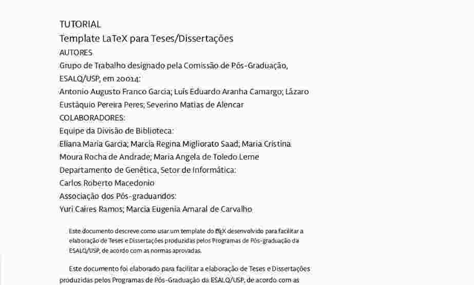


---

## Informações

- LER O TUTORIAL
- Parte Pré-textual
  - Editar o arquivo **_TodasInformações.tex_** e fazer as alterações
  - Não editar **_Ficha.tex_**
  - Etc
- Parte textual: o conteúdo em si
- Veja no diretório **_referencias_** o arquivo **_bibliografia.bib_**
- COMPILE e veja **_Tese.pdf_**


---

## Portabilidade

- *Arquivos texto* são os melhores!
  - [The Power of Plain Text](http://c2.com/cgi/wiki?PowerOfPlainText)
- Arquivos texto vs binários
- Excel vs .csv

---

## Referências Bibliográficas

- Grande parte do seu tempo será dispendido lendo/escrevendo
publicações
- Será preciso constantemente retornar as anotações e fazer diferentes
buscas
- Logo, qualquer investimento de tempo tem elevado retorno na
produtividade
- O template de Teses e Dissertações prevê o uso de algum
  gerenciador de referências (mas não é restrito a única plataforma)


---

## BibTex

- [BibTex](http://www.bibtex.org/)
- Formato texto, portátil, versátil, *lingua franca*
- Associado ao $\LaTeX$, mas pode ser usado como base de dados

---

## Formato


```r
@misc{ patashnik-bibtexing,
       author = "Oren Patashnik",
       title = "BIBTEXing",
       year = "1988" }
```

---


## Exemplos

-
[library.bib](https://raw.githubusercontent.com/augusto-garcia/Gerenciamento-Referencias/gh-pages/library.bib)

Mais detalhes: [Wikibooks](http://en.wikibooks.org/wiki/LaTeX/Bibliography_Management)


--- .segue .dark .quote

<q class = 'yellow'> Seja esperto. Crie sua base de dados em formato
que não seja dependente de programas específicos. </q>

---

## Gerenciadores de Referências

  1. [Mendeley](http://www.mendeley.com/) - minha escolha, combinado ao $\LaTeX$
  2. [Zotero](https://www.zotero.org/)
  3. [EndNote](http://endnote.com/)
  4. [Papers](http://www.papersapp.com/)
  5. [JabRef](http://jabref.sourceforge.net/)
  6. [citeulike](http://www.citeulike.org/)
  7. $\ldots$ (a lista é longa!)

---

## Pontos importantes

  1. Posso importar/exportar para o $BibTex$ ou algum outro formato genérico?
  2. Posso usar o programa para incluir as citações nos meus
  trabalhos?
  3. Quais são os formatos para citação disponíveis?
  4. Posso expandir/alterar estes formatos?


---

## Formatos para citação adotados pelas principais revistas

- [Citation Styles, CSL, http://citationstyles.org](http://citationstyles.org/)
  - Mais de 9000 estilos de citação abertos e gratuitos
  - As principais revistas participam e contribuem
  - Tais formatos podem ser importados em vários programas
  gerenciadores de referências

---

## Word


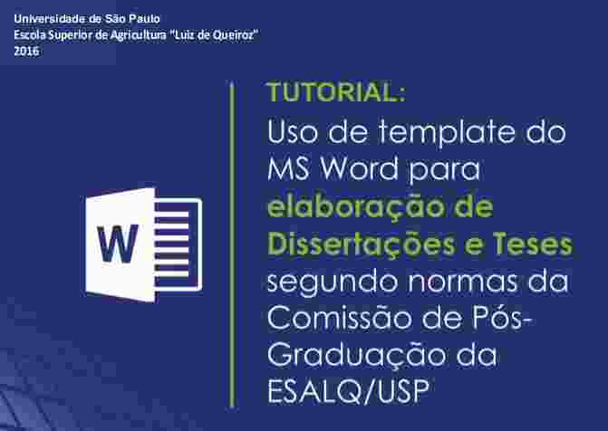


---

## Instale o template (arquivo com extensão .dotx)

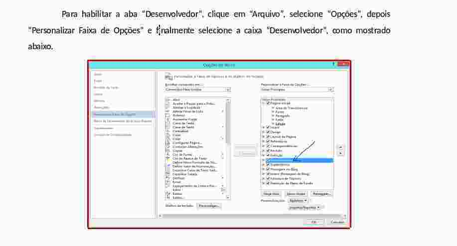


---

## Use a aba Desenvolvedor

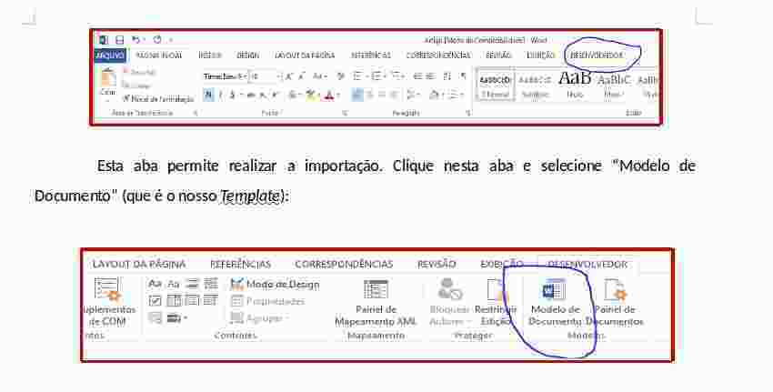


---

## Novos estilos estão agora disponíveis

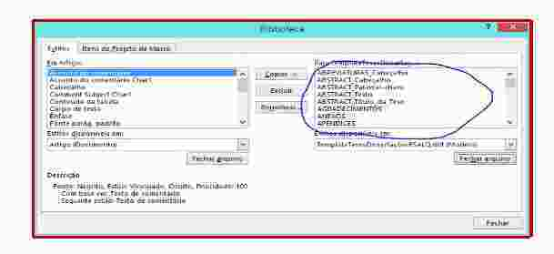


---

## Altere algumas configurações

- Tamanho da página
- Numeração
- Use os estilos do template

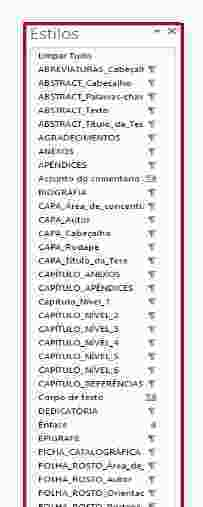


---

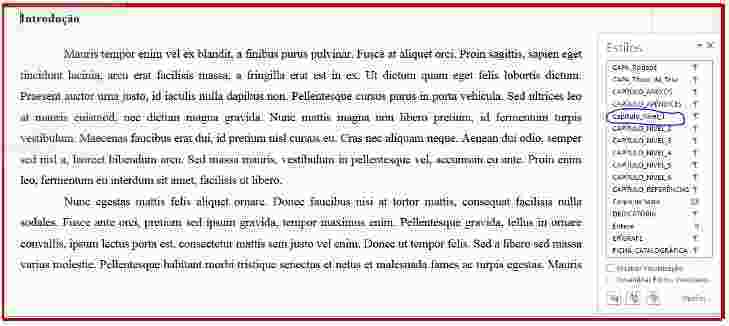


---


---

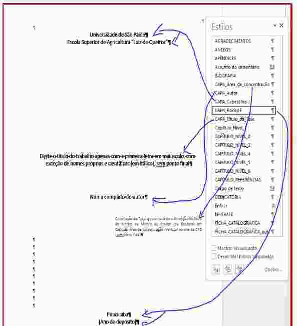

---

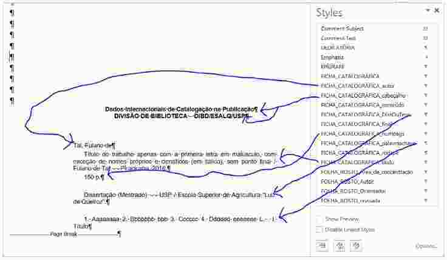


---

## Sumário: feito automaticamente

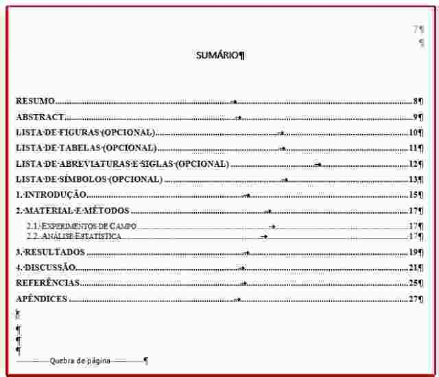


---

## Template com Gerenciador de Referências

- Fantástico!

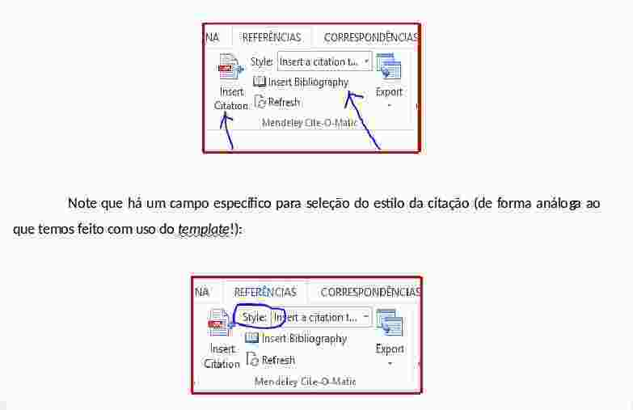


---

## Colaborador: Carlos Macedônio (LGN)

<iframe width="854" height="510" src="https://www.youtube.com/embed/fUO9bxkBWyU" frameborder="0" allowfullscreen></iframe>

---

<iframe width="854" height="510" src="https://www.youtube.com/embed/pdN-0KEPVHo" frameborder="0" allowfullscreen></iframe>


---

## Colaborador: Fernando Mayer (LCE)

- Template com **_knitr_**, em capítulos ou não 
  - [Link](https://github.com/fernandomayer/ESALQ-Tese-Template)
- **_Overleaf_** ($\LaTeX$ online) para tese em capítulos
  - [Link](https://www.overleaf.com/latex/templates/esalq-tese-em-capitulos/rnpjnsggtyfr)
  

---

## Etapas Futuras

- Template em [Markdown](https://pt.wikipedia.org/wiki/Markdown) e
  [RMarkdown](https://bookdown.org/)
- [Pandoc](https://pandoc.org/)


--- bg:#fee6ce

<q>OBRIGADO!</q>


